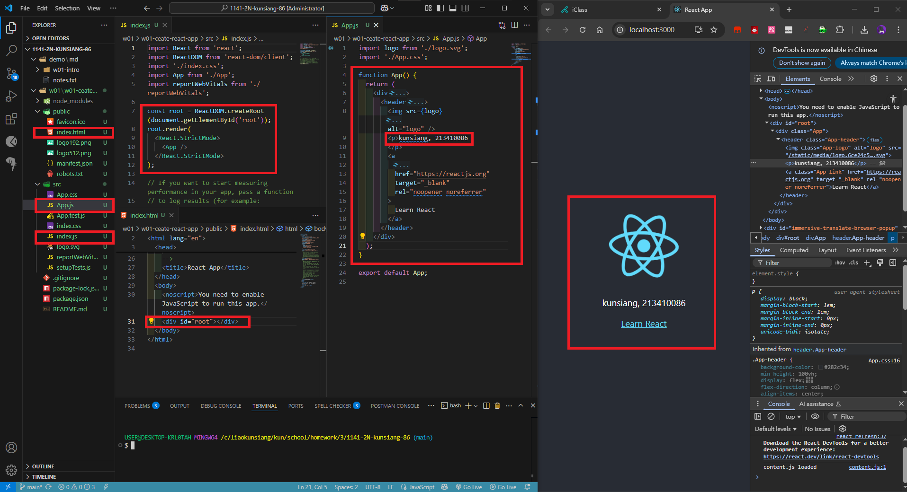
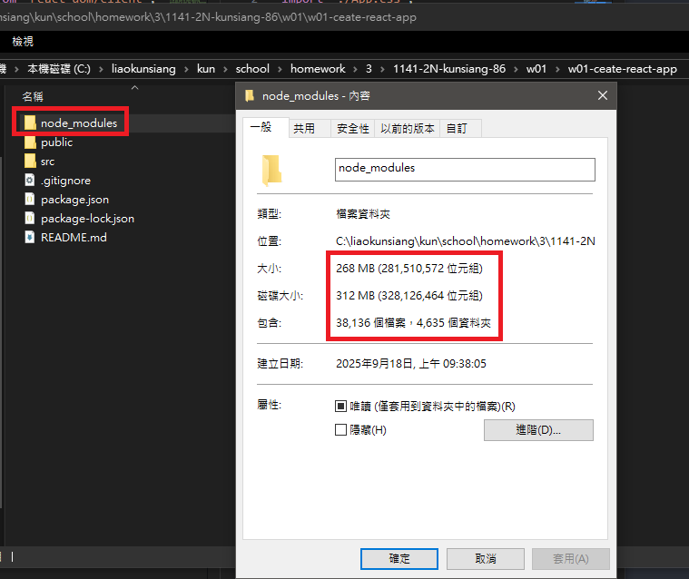
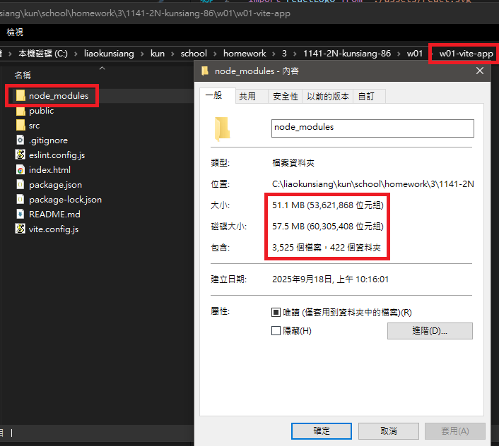
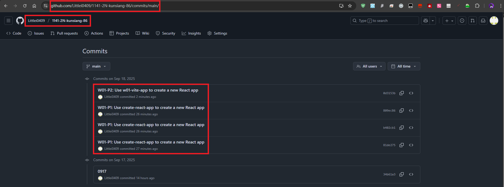
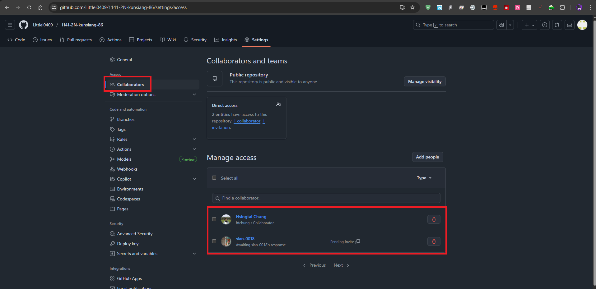

[My Github URL](https://github.com/Littlei0409/1141-2N-kunsiang-86)

#### W01-P1: Use create-react-app to create a new React app

#### => show how the index.html page being rendered



#### => share the size of node module



```
809ec86 Littlei0409     Thu Sep 18 10:10:11 2025 +0800  W01-P1: Use create-react-app to create a new React app
```

#### W01-P2: Use vite to create a new React app
 
#### => show how the index.html page being rendered
 

 
#### => share the size of node module
 

 
```
0d3153b Littlei0409     Thu Sep 18 10:34:15 2025 +0800  W01-P2: Use w01-vite-app to create a new React app
```

### W01-logs: git logs of W01 and share to htchung@gms.tku.edu.tw (teacher) and sian-0018 (TA)




