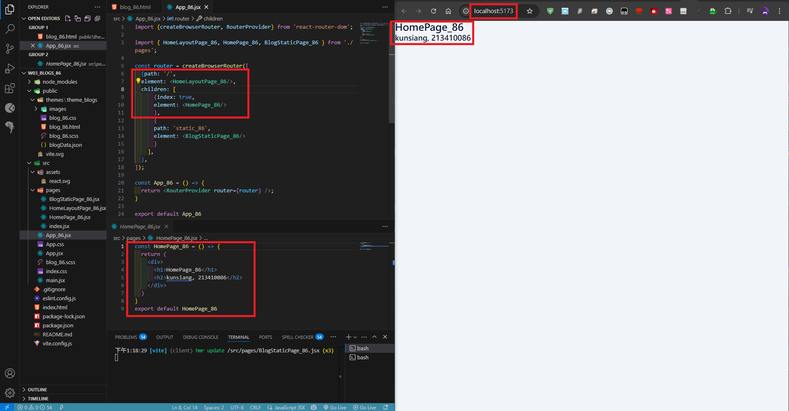
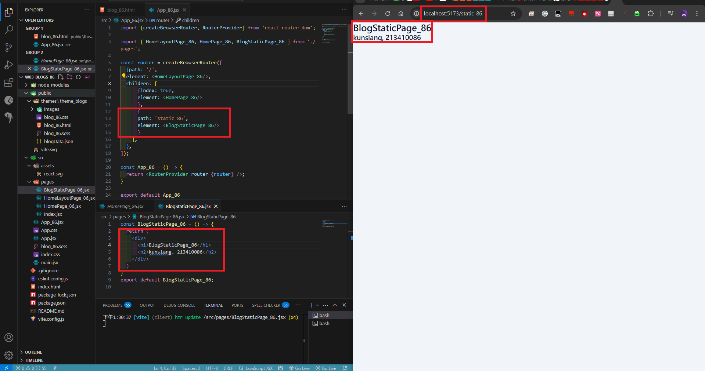
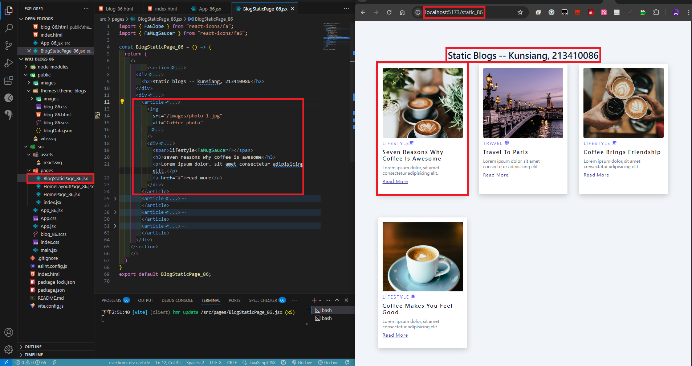
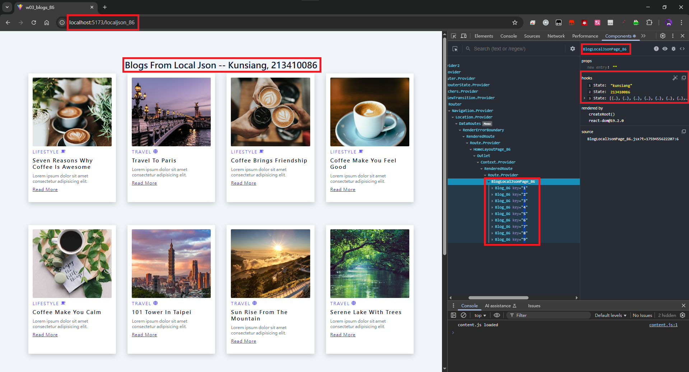
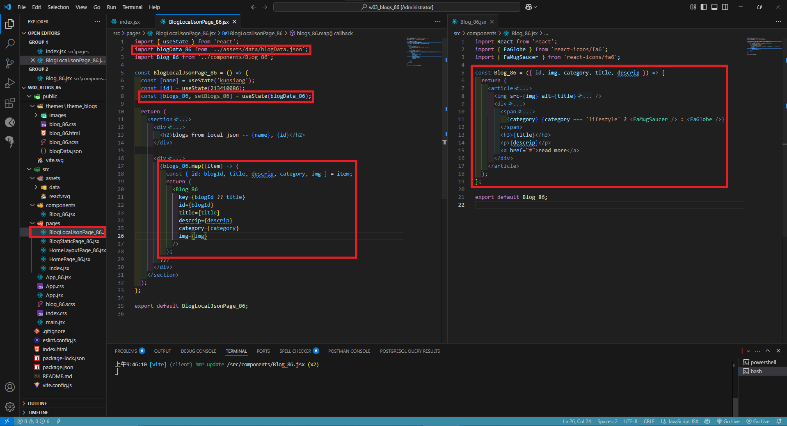
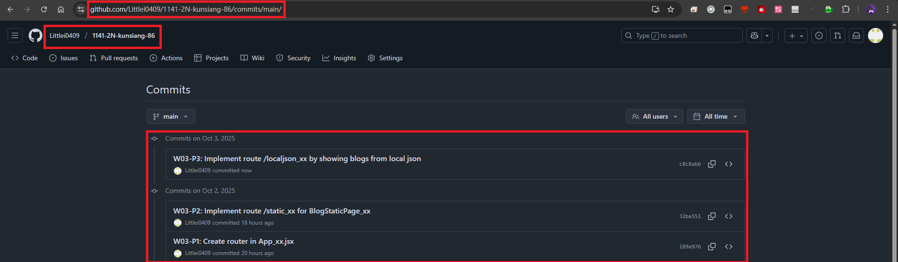

[My Github URL](https://github.com/Littlei0409/1141-2N-kunsiang-86)

#### W03-P1: Create router in App_xx.jsx
 
#### => route / for HomePage_xx
 

 
#### => route /static_xx for BlogStaticPage_xx
 

 
```
189a976 Littlei0409     Thu Oct 2 13:36:53 2025 +0800   W03-P1: Create router in App_xx.jsx
```

### W03-P2: Implement route /static_xx for BlogStaticPage_xx
 

 
```
32ba551 Littlei0409     Thu Oct 2 15:05:44 2025 +0800   W03-P2: Implement route /static_xx for BlogStaticPage_xx
```

#### W03-P3: Implement route /localjson_xx by showing blogs from local json
 
#### => Chrome demo using React DevTools
 

 
#### => code for BlogLocalJson_xx
 

 
```
W03-P3: Implement route /localjson_xx by showing blogs from local json
```

#### ### W03-logs: git logs of W03
