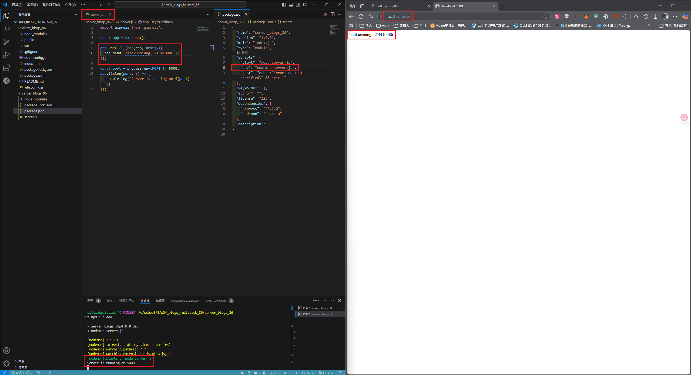
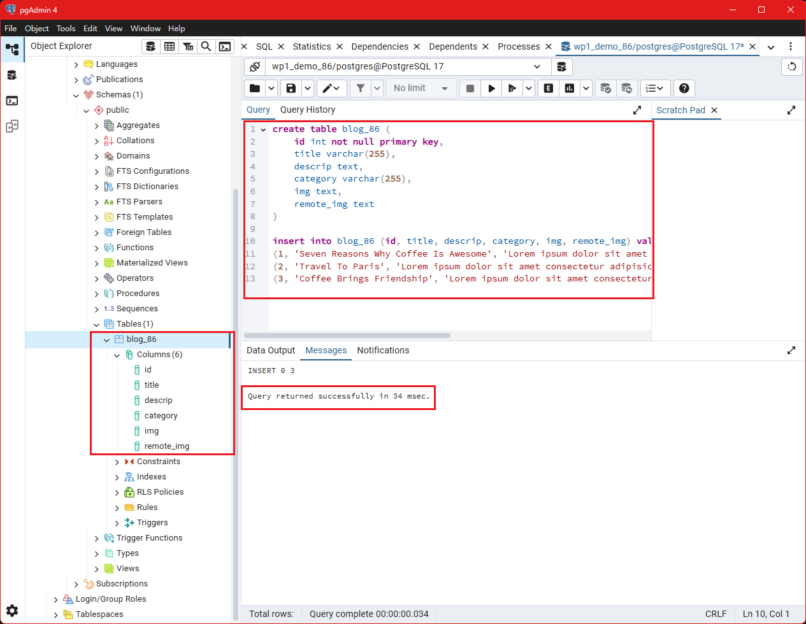
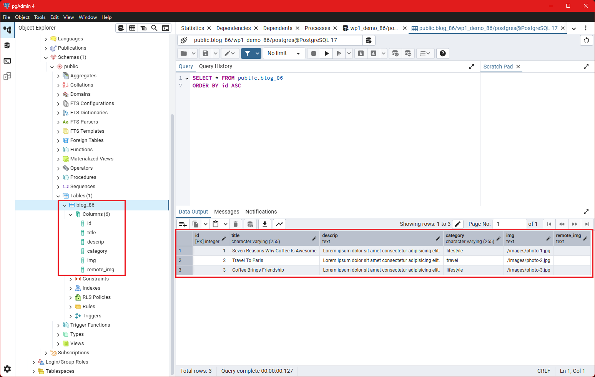
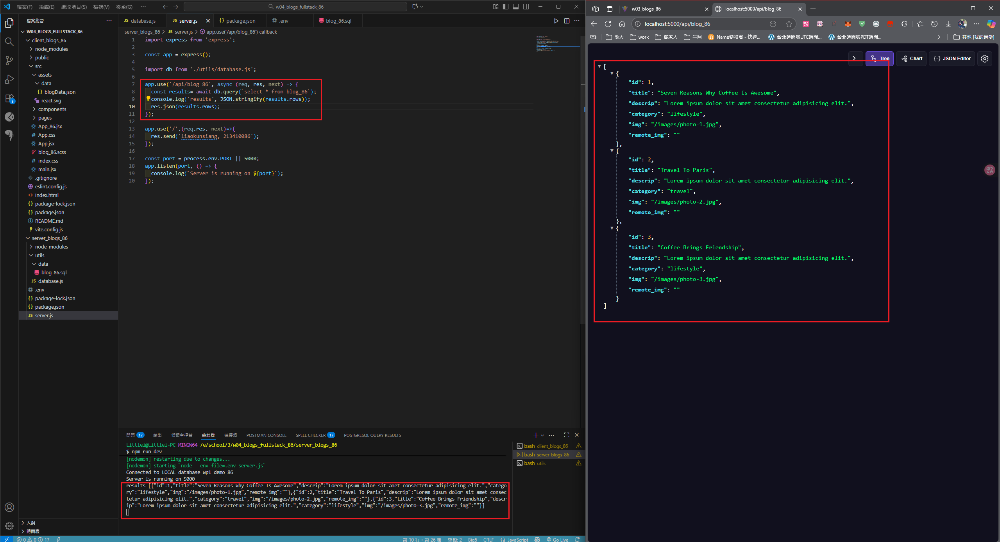
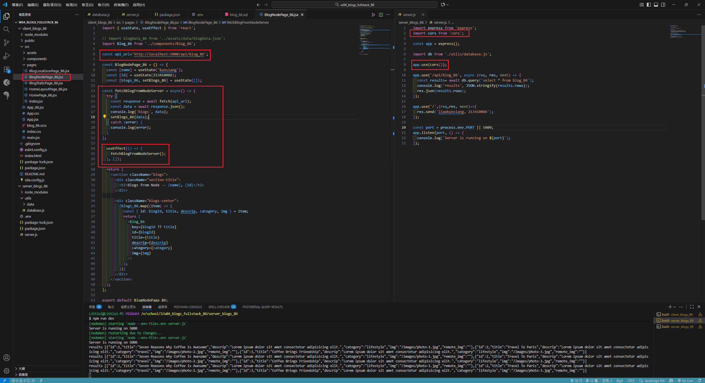
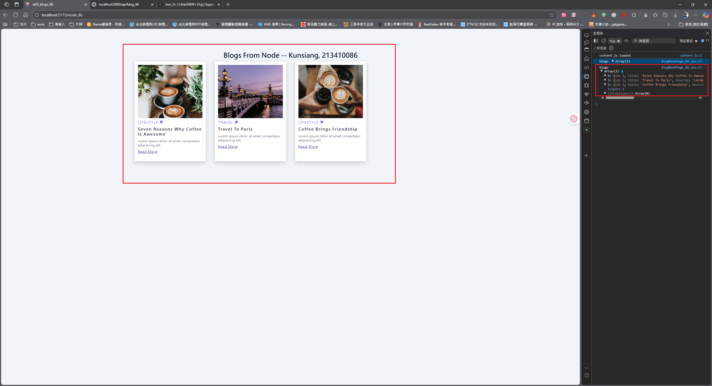

[My Github URL](https://github.com/Littlei0409/1141-2N-kunsiang-86)

#### W04-P1: Create a express Web server to show your info
 

 
```
c8a42ac Littlei0409     Sun Oct 12 19:35:44 2025 +0800  W04-P1: Create a express Web server to show your info
```

####¡@W04-P2: Create blog_xx table with 3 data, implement route /api/blog_xx to return a json array with 3 data
 
#### => SQL to create blog_xx table and 3 data
 

 
#### => show 3 data
 

 
#### => implement route /api/blog_xx
 

 
```
180eb12 Littlei0409     Sun Oct 12 21:43:24 2025 +0800  W04-P2: Create blog_xx table with 3 data, implement route /api/blog_xx to return a json array with 3 data
```

#### W04-P3: from client side to get json data from Node
 
#### => modified client and server code
 

 
#### => Chrome, show 3 blogs
 

 
```
0cb5991 Littlei0409     Sun Oct 12 23:28:42 2025 +0800  W04-P3: from client side to get json data from Node
```

#### ### W03-logs: git logs of W03
