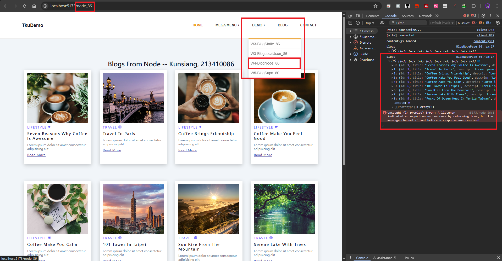
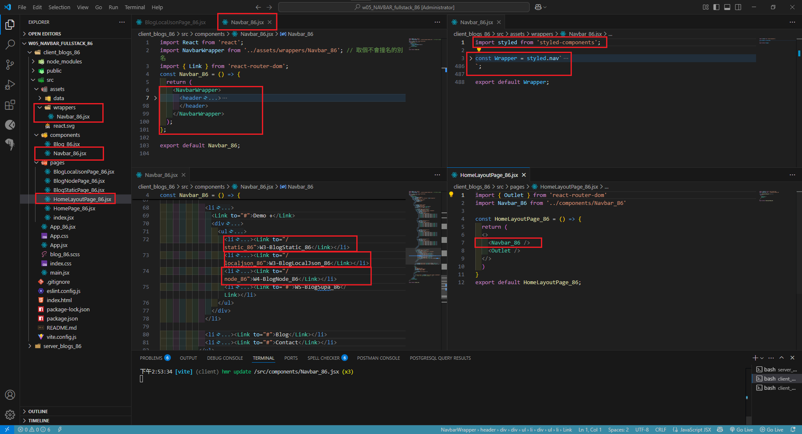
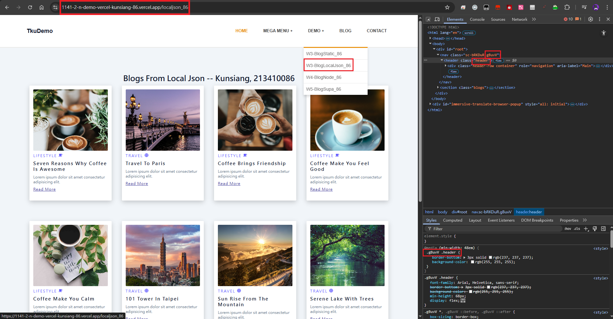
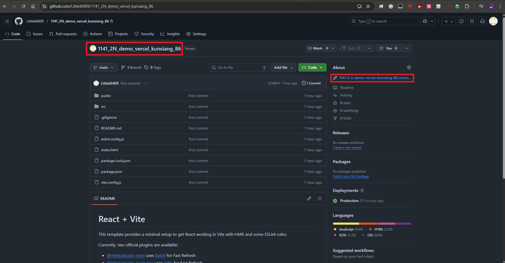
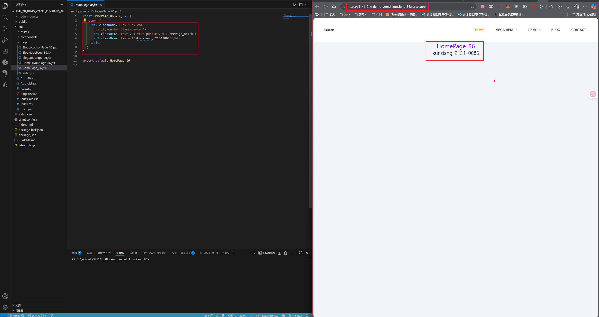
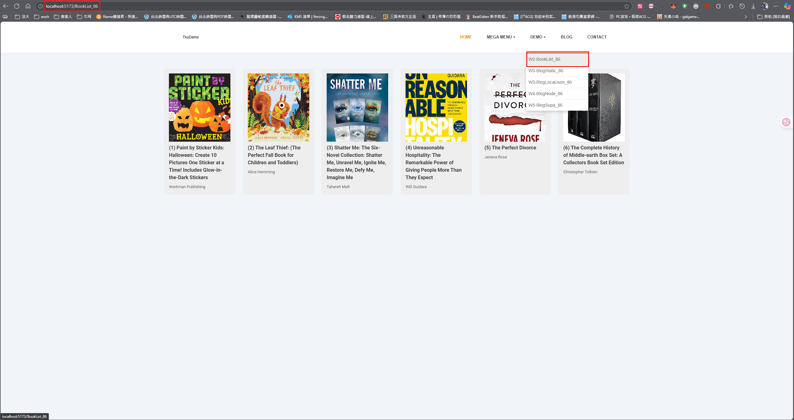
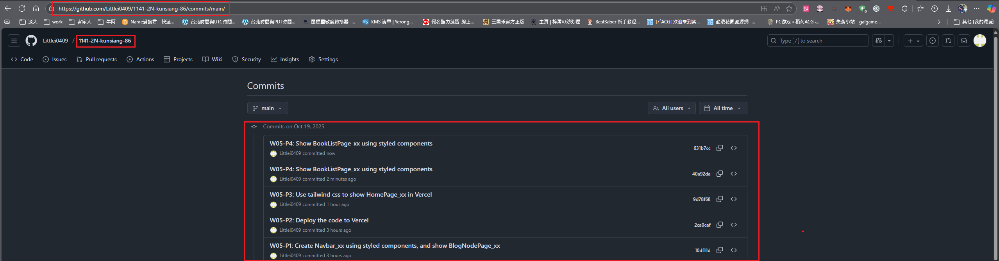

[My Github URL](https://github.com/Littlei0409/1141-2N-kunsiang-86)

##### W05-P1: Create Navbar_xx using styled components, and show BlogNodePage_xx
 
##### => Chrome
 

 
##### => relevant code
 

 
```
10df11d Littlei0409     Sun Oct 19 19:27:25 2025 +0800  W05-P1: Create Navbar_xx using styled components, and show BlogNodePage_xx
```

##### W05-P2: Deploy the code to Vercel
 
#### => Show BlogLocalJson in Vercel
 

 
#### => Github repo with Vercel link
 

 
#### => Github demo_vecel repo and Vercel URL
 
[Github URL for Vercel](https://github.com/Littlei0409/1141_2N_demo_vercel_kunsiang_86)
[Vercel URL](https://1141-2-n-demo-vercel-kunsiang-86.vercel.app/)
 
```
2ca0caf Littlei0409     Sun Oct 19 19:28:06 2025 +0800  W05-P2: Deploy the code to Vercel
```

##### W05-P3: Use tailwind css to show HomePage_xx in Vercel
 

 
```
9d78f68 Littlei0409     Sun Oct 19 21:47:23 2025 +0800  W05-P3: Use tailwind css to show HomePage_xx in Vercel
```

##### W05-P4: Show BookListPage_xx using styled components
 


```
Show BookListPage_xx using styled components
```

#### ### W05-logs: git logs of W03
