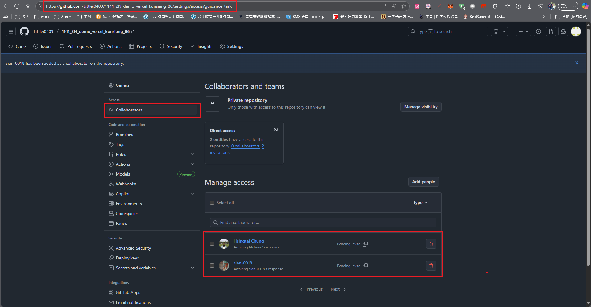
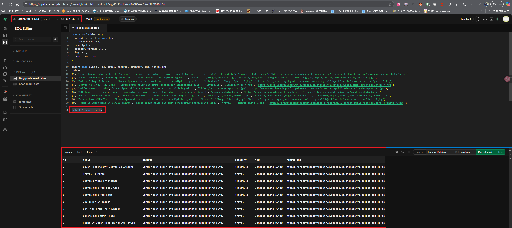
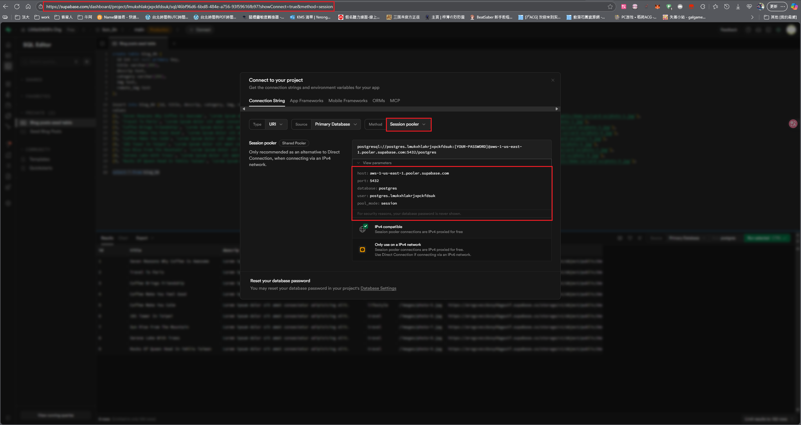
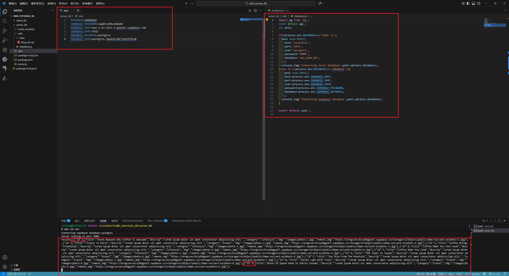
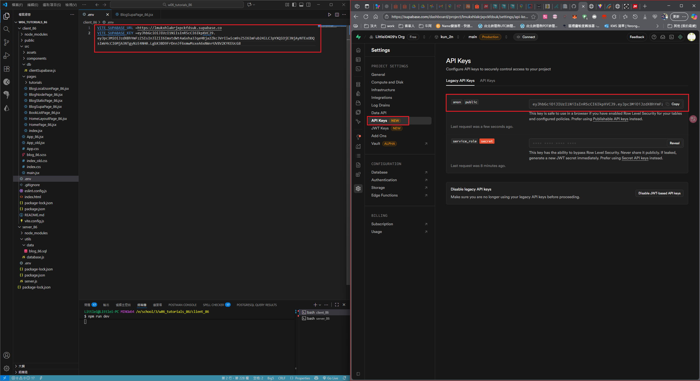
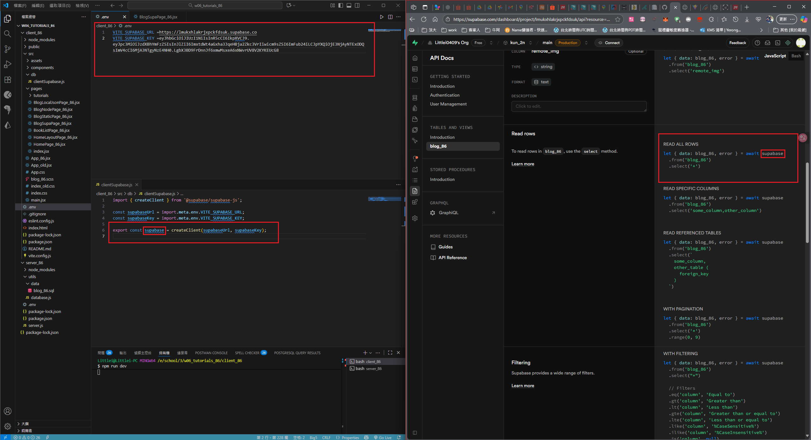
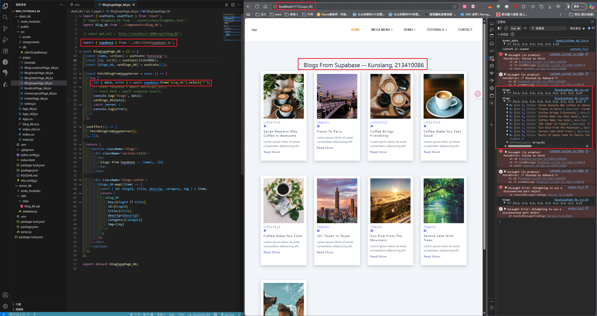
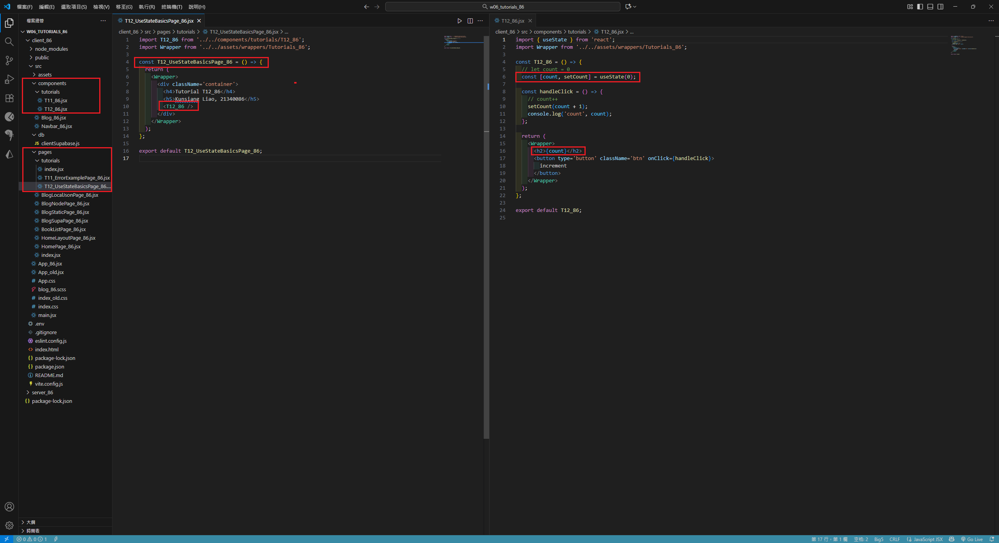
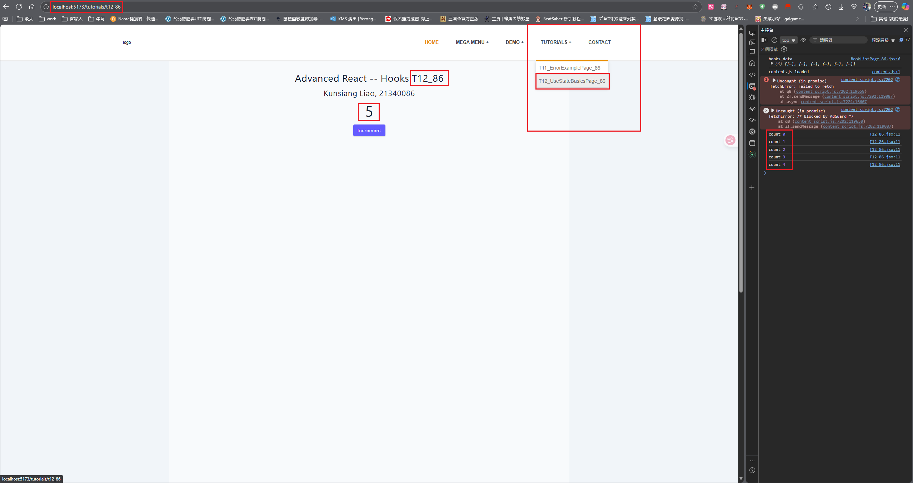
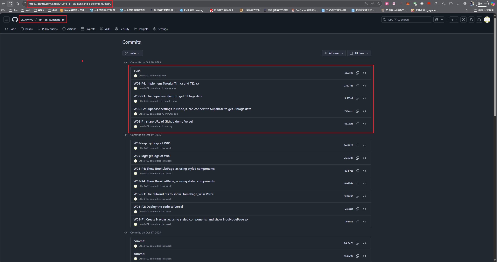

[My Github URL](https://github.com/Littlei0409/1141-2N-kunsiang-86)

### W06-P1: share URL of Github demo Vercel
 

 
```
W06-P1: share URL of Github demo Vercel
```

### W06-P2: Supabase settings in Node.js, can connect to Supabase to get 9 blogs data
 
#### => able to get 9 blogs data in Supabase
 

 
#### => connect parameters in Supabase
 

 
#### => server code in Supabase setting
 

 
```
W06-P2: Supabase settings in Node.js, can connect to Supabase to get 9 blogs data
```

### W06-P3: Use Supabase client to get 9 blogs data
 
#### => show API keys in Supabase
 

 
#### => Supabase client code
 

 
#### => Use BlogSupaPage_xx.jsx to get blogs data from Supabase
 

 
```
W06-P3: Use Supabase client to get 9 blogs data
```

W06-P4: Implement Tutorial T11_xx and T12_xx
 
#### => show code for T12_xx
 

 
#### => Chrome result
 

 
```
W06-P4: Implement Tutorial T11_xx and T12_xx
```

##### W06-logs: git logs of W06
