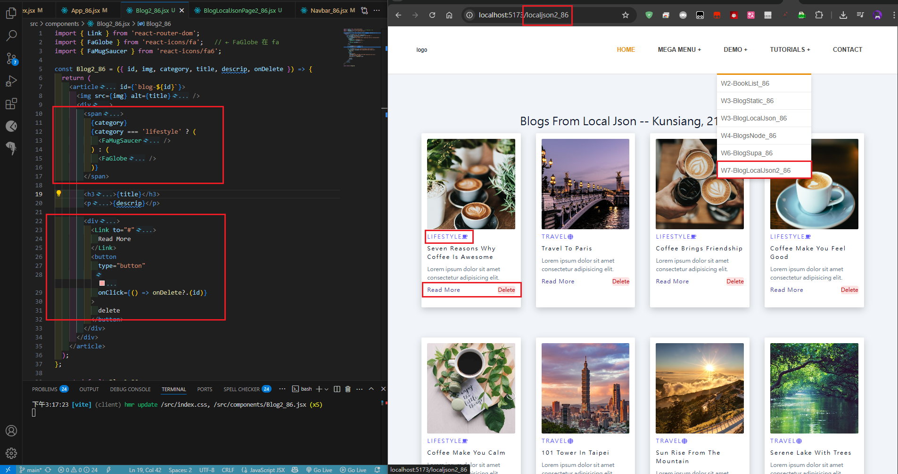
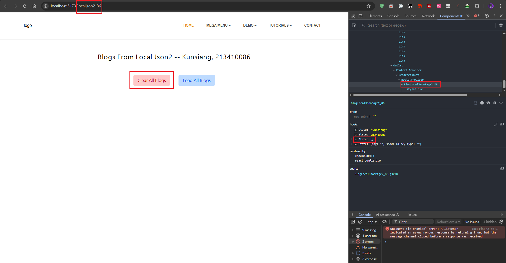
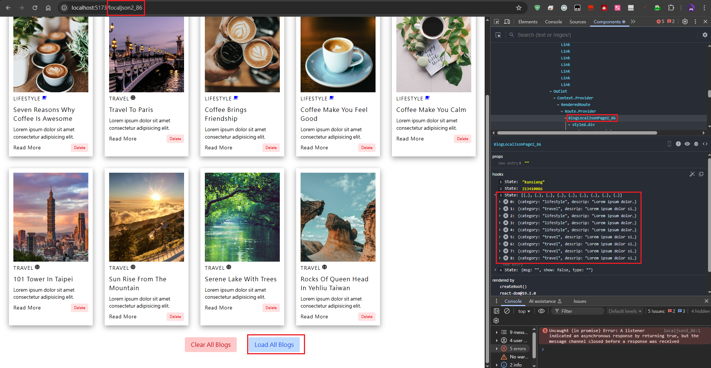
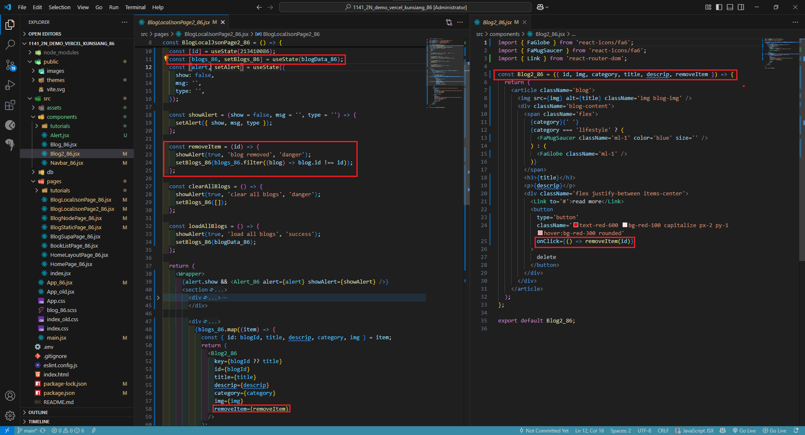
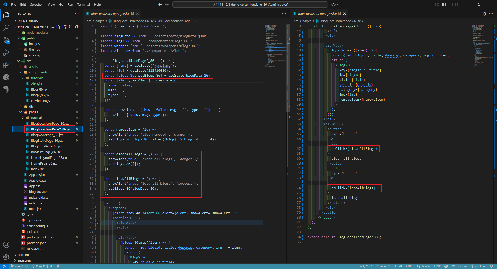
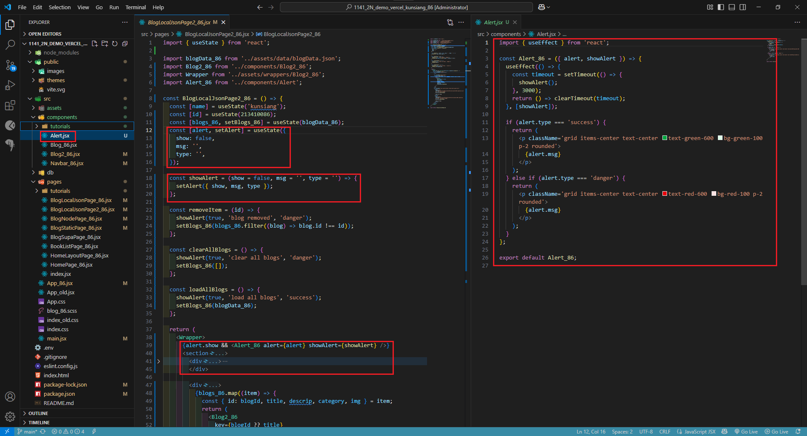

[My Github URL](https://github.com/Littlei0409/1141-2N-kunsiang-86)

#### W07-P1: Use tailwind to style react icons and add a delete button
 

 
```
W07-P1: Use tailwind to style react icons and add a delete button
```

#### W07-P2: Implement delete a blog, clear all blogs, load all blogs
 
#### => delete first blog
 

 
#### => clear all blogs
 

 
#### => load all blogs
 

 
#### => code for deleting a blog
 

 
#### => code for clear and load all blogs
 

 
```
W07-P2: Implement delete a blog, clear all blogs, load all blogs
```

#### W07-P3: Implement Alert_xx
 
#### => code for Alert_xx
 

 
```
W07-P3: Implement Alert_xx
```