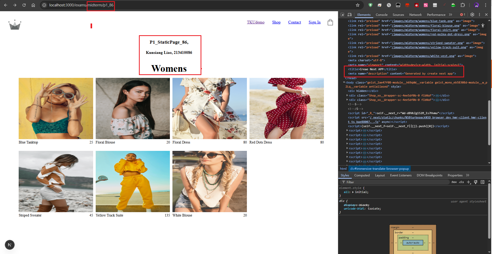
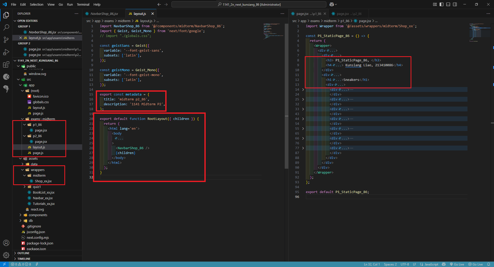
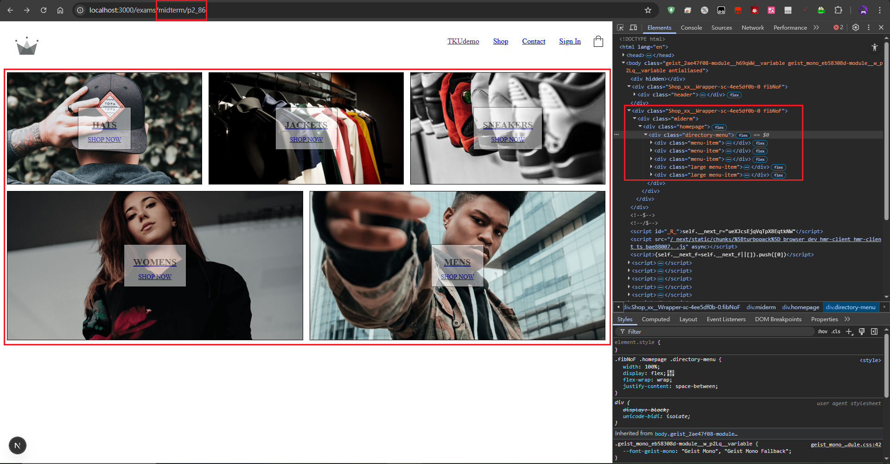
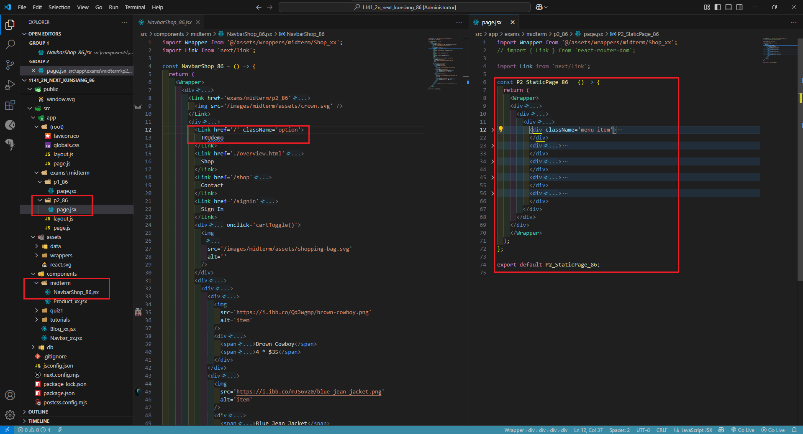
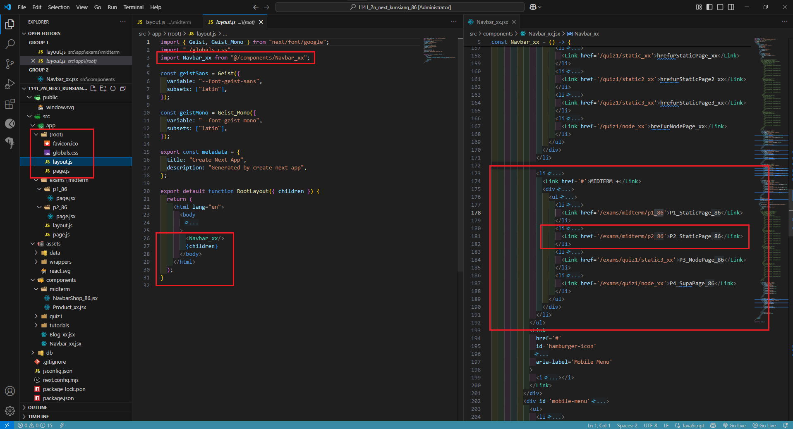
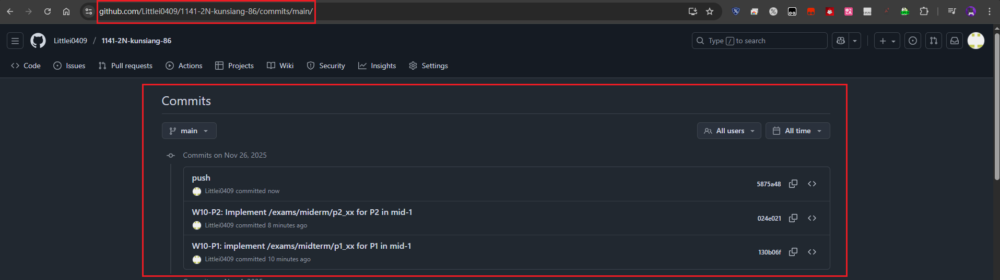

[My Github URL](https://github.com/Littlei0409/1141-2N-kunsiang-86)

#### W10-P1: implement /exams/midterm/p1_xx for P1 in mid-1
 
##### => Chrome, show P1 page with meta data
 

 
##### => show the relevant code
 

 
```
130b06f Littlei0409     Wed Nov 26 16:31:17 2025 +0800  W10-P1: implement /exams/midterm/p1_xx for P1 in mid-1
```

#### W10-P2: Implement /exams/miderm/p2_xx for P2 in mid-1
 
#### => shown in Chrome
 

 
#### => the relevant code for P2
 

 
#### => Navbar_xx for root layout
 

 
```

```

#### W10-logs: git logs of 10
