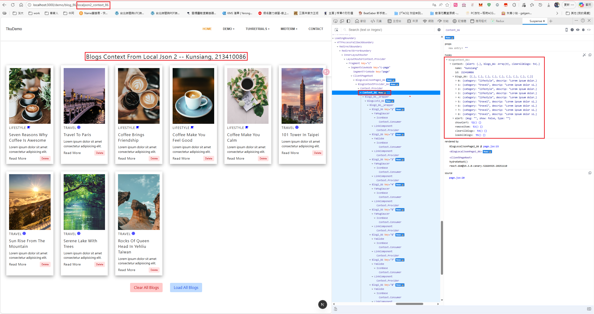
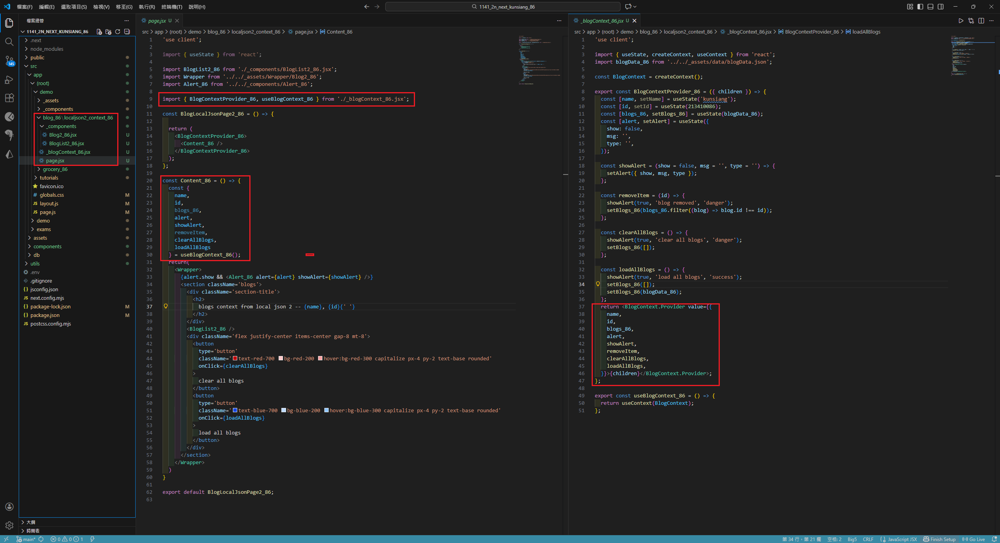
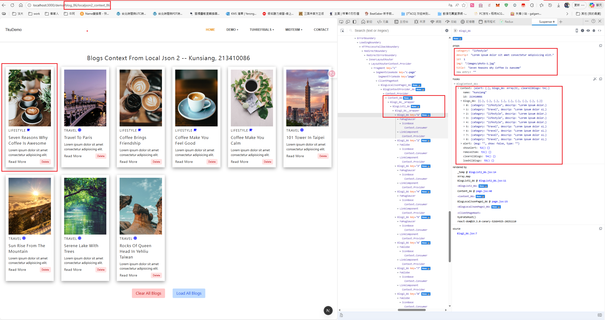
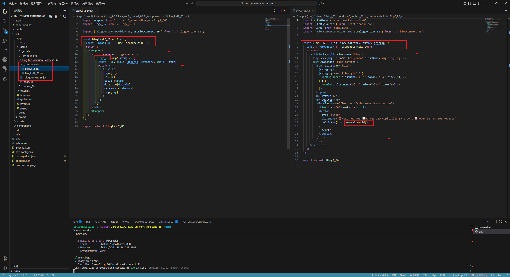
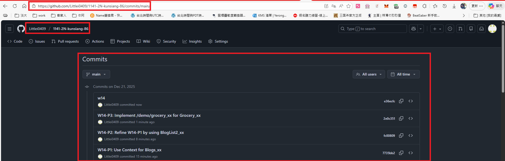

[My Github URL](https://github.com/Littlei0409/1141-2N-kunsiang-86)

#### W14-P1: Use Context for Blogs_xx
 
#### => Chrome, show blogs_xx in Content component
 

 
#### => relevant code
 

 
```
7735bb2 Littlei0409     Sun Dec 21 23:19:16 2025 +0800  W14-P1: Use Context for Blogs_xx
```

W14-P2: Refine W14-P1 by using BlogList2_xx
 
#### => Chrome, show BlogList2_xx, Blog2_xx component
 

 
#### => relevant code
 

 
```

```

#### W13-logs: git logs of 13

