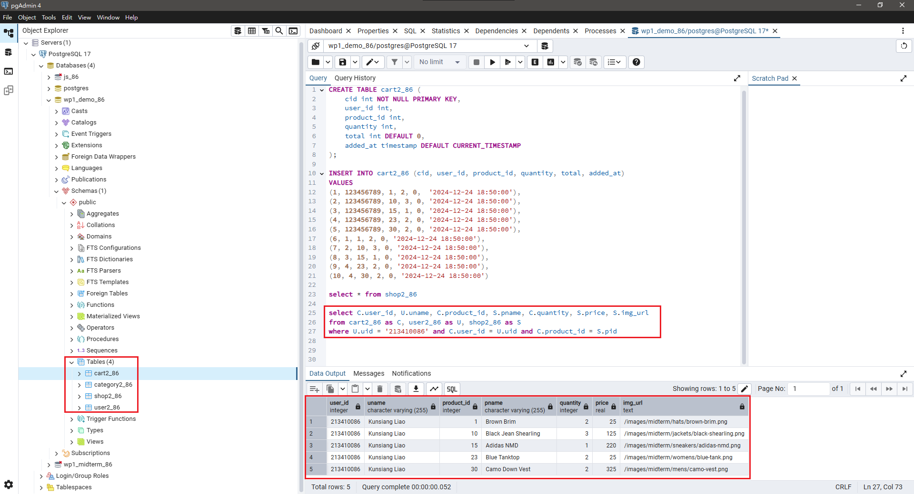
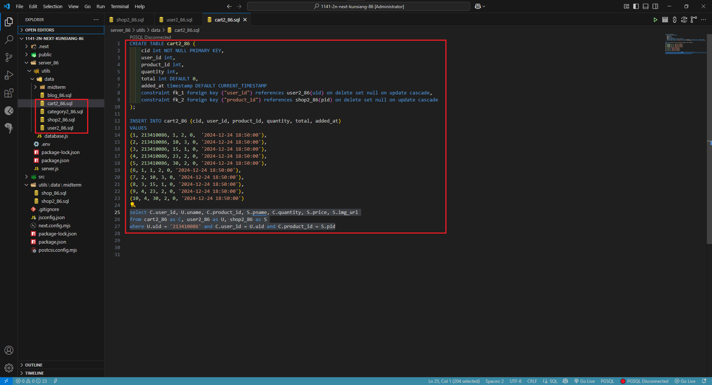

[My Github URL](https://github.com/Littlei0409/1141-2N-kunsiang-86)

#### W15-P1: Create tables category2_xx, shop2_xx, user2_xx, cart2_xx, and put 5 products into a cart for the user of your id
 
#### => pgAdmin4, show SQL command to get the needed info
 

 
#### => sql code
 

 
```
4689645 Littlei0409     Wed Dec 31 13:43:43 2025 +0800  W15-P1: Create tables category2_xx, shop2_xx, user2_xx, cart2_xx, and put 5 products into a cart for the user of your id
```

#### W15-P2: Implement route /api/shop_xx/cart/:uid to get the info as the SQL in W15-P1
 

 
```

```

#### W15-P3: Use localStorage
 
#### => Implement setLocalStorage
 

 
#### => Implement getLocalStorage
 

 
```

```

#### W15-logs: git logs of 15

